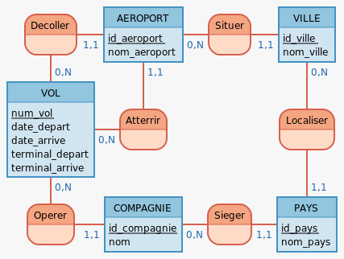

# sae_devmobile

## Comment lancer les applications

### 1. API Flask (`API_REST_Alchemy`)

L'API REST est développée en Python avec Flask et SQLAlchemy.

Pour la lancer :

```bash
cd API_REST_Alchemy
python3 -m venv venv
source venv/bin/activate  # Sur Windows: venv\Scripts\activate
pip install -r requirements.txt
flask --app todo run      # ou python -m flask run
```

### 2. Client Web Vue.js (`aeroportSPA`)

L'application web est une Single Page Application (SPA) développée avec Vue 3 et Vite.

Pour la lancer :

```bash
cd aeroportSPA
npm install
npm run dev
```

### 3. Application Mobile (`mobile`)

L'application mobile est développée avec Flutter.

Pour la lancer :

```bash
cd mobile
flutter pub get
flutter run
```

## Dépendances Fonctionnelle

- id_pays -> nom_pays
- id_ville -> nom_ville, #id_pays
- id_aeroport -> nom_aeroport, #id_ville
- id_compagnie -> nom_compagnie, #id_pays

- (id_compagnie, numero_vol, dh_depart) -> #id_aeroport_depart, terminal_depart, #id_aeroport_arrivee, terminal_arrivee, dh_arrive
  - #id_ville -> #id_pays
  - #id_aeroport_depart -> #id_ville
  - #id_aeroport_arrivee -> #id_ville

## MCD


