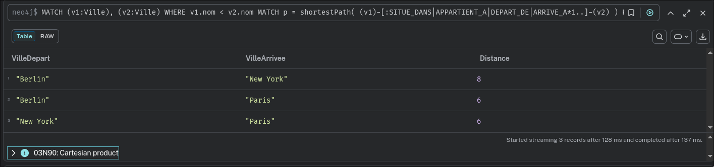

# RAPPORT SAE BD

MAUBERT Célestin - FOUCHER Matteo - ROUSSEAU Esteban

## 3.1 Modèle relationnel

### MCD


### Script Création

```sql

CREATE TABLE PAYS (
    id_pays INT,
    nom_pays VARCHAR2(25),
    CONSTRAINT pk_pays PRIMARY KEY (id_pays)
);

CREATE TABLE VILLE (
    id_ville INT,
    nom_ville VARCHAR2(25),
    id_pays INT,
    CONSTRAINT pk_ville PRIMARY KEY (id_ville)
);

CREATE TABLE AEROPORT (
    id_aeroport INT,
    nom_aeroport VARCHAR2(25) UNIQUE,
    id_ville INT,
    CONSTRAINT pk_aeroport PRIMARY KEY (id_aeroport)
);

CREATE TABLE COMPAGNIE (
    id_compagnie INT,
    nom VARCHAR2(20),
    id_pays INT,
    CONSTRAINT pk_compagnie PRIMARY KEY (id_compagnie)
);

CREATE TABLE VOL (
    num_vol INT,
    id_compagnie INT,
    date_depart DATE,
    date_arrive DATE,
    id_aeroport_depart INT,
    terminal_depart INT,
    id_aeroport_arrive INT,
    terminal_arrive INT,
    CONSTRAINT pk_vol PRIMARY KEY (num_vol, id_compagnie, date_depart)
);

ALTER TABLE AEROPORT
ADD CONSTRAINT fk_aeroport_ville
FOREIGN KEY (id_ville) REFERENCES VILLE(id_ville);

ALTER TABLE VILLE
ADD CONSTRAINT fk_ville_pays
FOREIGN KEY (id_pays) REFERENCES PAYS(id_pays);

ALTER TABLE COMPAGNIE
ADD CONSTRAINT fk_compagnie_pays
FOREIGN KEY (id_pays) REFERENCES PAYS(id_pays);

ALTER TABLE VOL
ADD CONSTRAINT fk_vol_compagnie
FOREIGN KEY (id_compagnie) REFERENCES COMPAGNIE(id_compagnie);

ALTER TABLE VOL
ADD CONSTRAINT fk_vol_aeroport_depart
FOREIGN KEY (id_aeroport_depart) REFERENCES AEROPORT(id_aeroport);

ALTER TABLE VOL
ADD CONSTRAINT fk_vol_aeroport_arrive
FOREIGN KEY (id_aeroport_arrive) REFERENCES AEROPORT(id_aeroport);
```

### Requêtes Relationnel

> Donner les villes que nous pouvons atteindre par vols directs qui partent de Paris

```sql
SELECT
    VILLE.nom_ville
FROM
    VOL
    JOIN AEROPORT ON VOL.id_aeroport_arrive = AEROPORT.id_aeroport
    JOIN VILLE ON AEROPORT.id_ville = VILLE.id_ville
    JOIN AEROPORT A2 ON VOL.id_aeroport_depart = A2.id_aeroport
    JOIN VILLE V2 ON A2.id_ville = V2.id_ville
WHERE
    V2.nom_ville = 'Paris';
```

> En considérant les horaires des vols, veuillez fournir la liste des villes accessibles depuis Paris avec un vol comprenant UNE correspondance. L’objectif est de permettre aux passagers de réaliser leur correspondance.

```sql
SELECT DISTINCT
    v_dest.nom_ville
FROM
    VOL v1
    JOIN VOL v2 ON v1.id_aeroport_arrive = v2.id_aeroport_depart
    AND v1.date_arrive < v2.date_depart
    JOIN AEROPORT a_paris ON v1.id_aeroport_depart = a_paris.id_aeroport
    JOIN VILLE v_paris ON a_paris.id_ville = v_paris.id_ville
    JOIN AEROPORT a_dest ON v2.id_aeroport_arrive = a_dest.id_aeroport
    JOIN VILLE v_dest ON a_dest.id_ville = v_dest.id_ville
WHERE
    v_paris.nom_ville = 'Paris';
```

> En considérant les horaires des vols, veuillez fournir la liste des villes accessibles depuis Paris avec un vol comprenant DEUX correspondances.

```sql
SELECT DISTINCT
    v_dest.nom_ville
FROM
    VOL v1
    JOIN VOL v2 ON v1.id_aeroport_arrive = v2.id_aeroport_depart
    AND v1.date_arrive < v2.date_depart
    JOIN VOL v3 ON v2.id_aeroport_arrive = v3.id_aeroport_depart
    AND v2.date_arrive < v3.date_depart
    JOIN AEROPORT a_paris ON v1.id_aeroport_depart = a_paris.id_aeroport
    JOIN VILLE v_paris ON a_paris.id_ville = v_paris.id_ville
    JOIN AEROPORT a_dest ON v3.id_aeroport_arrive = a_dest.id_aeroport
    JOIN VILLE v_dest ON a_dest.id_ville = v_dest.id_ville
WHERE
    v_paris.nom_ville = 'Paris';
```

> Veuillez fournir la liste des villes accessibles depuis Paris, en tenant compte des horaires de vol, avec des vols directs ou un nombre quelconque de correspondances.

```sql
WITH ACCESSIBLE (id_aeroport_arrivee, id_ville_arrivee, nom_ville_arrivee, date_arrive, nb_correspondances) AS (
    -- Anchor member : Vols directs depuis Paris
    SELECT
        vol.id_aeroport_arrive,
        v_arr.id_ville,
        v_arr.nom_ville,
        vol.date_arrive,
        0
    FROM VOL vol
    JOIN AEROPORT a_dep ON vol.id_aeroport_depart = a_dep.id_aeroport
    JOIN VILLE v_dep ON a_dep.id_ville = v_dep.id_ville
    JOIN AEROPORT a_arr ON vol.id_aeroport_arrive = a_arr.id_aeroport
    JOIN VILLE v_arr ON a_arr.id_ville = v_arr.id_ville
    WHERE v_dep.nom_ville = 'Paris'
    UNION ALL
    -- Recursive member : Vols avec correspondances
    SELECT
        vol.id_aeroport_arrive,
        v_arr.id_ville,
        v_arr.nom_ville,
        vol.date_arrive,
        acc.nb_correspondances + 1
    FROM ACCESSIBLE acc
    JOIN VOL vol ON vol.id_aeroport_depart = acc.id_aeroport_arrivee AND vol.date_depart > acc.date_arrive
    JOIN AEROPORT a_arr ON vol.id_aeroport_arrive = a_arr.id_aeroport
    JOIN VILLE v_arr ON a_arr.id_ville = v_arr.id_ville
    WHERE v_arr.nom_ville <> 'Paris'
)
-- https://oracle-base.com/articles/11g/recursive-subquery-factoring-11gr2#cyclic
-- usage de cycle pour éviter les boucles infinies
CYCLE id_aeroport_arrivee SET is_cycle TO 1 DEFAULT 0
SELECT nom_ville_arrivee AS ville_accessible, MIN(nb_correspondances) AS nb_correspondances
FROM ACCESSIBLE
WHERE nom_ville_arrivee <> 'Paris' AND is_cycle = 0
GROUP BY nom_ville_arrivee
ORDER BY ville_accessible;
```

## 3.2 Modèle objet-relationnel

### Script de création

```sql
create
or replace type equipageT as object (nom varchar2 (20), fonction varchar2 (20));

create type equipageTabT as table of equipageT;

create
or replace type indicesT as object (
    Atype varchar2 (20),
    valeur number (1),
    poid number (2)
);

create type indicesList as VARRAY (3) of indicesT;

create table
    VOL (
        NumVol varchar2 (20),
        AeroDep varchar2 (10),
        DateHeureDep date,
        AeroArr varchar2 (10),
        DateHeureArr date,
        Equipage equipageT,
        IndicesQualite indicesList
    ) nested table Equipage store as Equipage_nt;
```

### Requêtes Objet Relationnel

> Pour chaque vol, donner le nombre de personnes de l’équipage, par fonction

```sql
SELECT
    v.NumVol,
    e.fonction,
    COUNT(*) as nombre_personnes
FROM VOL v,
     TABLE(v.Equipage) e
GROUP BY v.NumVol, e.fonction
ORDER BY v.NumVol, e.fonction;
```

> Pour chaque pilote, indiquer combien des vols lui sont associés

```sql
SELECT
    e.nom as pilote,
    COUNT(DISTINCT v.NumVol) as nombre_vols
FROM VOL v,
     TABLE(v.Equipage) e
WHERE e.fonction = 'Pilote'
GROUP BY e.nom
ORDER BY e.nom;
```

> L’impact d’un indice de qualité est donné par le produit de sa valeur et du poids que lui est attribué. Pour chaque vol, indiquer l’impact de chaque indice de qualité.

```sql
SELECT
    v.NumVol,
    i.Atype as indice_type,
    i.valeur,
    i.poid,
    (i.valeur * i.poid) as impact
FROM VOL v,
     TABLE(v.IndicesQualite) i
ORDER BY v.NumVol, i.Atype;
```

> Pour chaque indice de qualit´e, calculer son impact moyen

```sql
SELECT
    i.Atype as indice_type,
    ROUND(AVG(i.valeur * i.poid), 2) as impact_moyen
FROM VOL v,
     TABLE(v.IndicesQualite) i
GROUP BY i.Atype
ORDER BY i.Atype;
```

## 3.3 Modèle Logique (Datalog)

### Prédicats extensionnels

> Identifiez quels sont les prédicats extensionnels de votre base de données déductive

Les prédicats extensionnels de notre base de données sont :

**vol(Compagnie, Numero, VilleDepart, PaysDepart, AeroportDepart, TerminalDepart, DateDepart, HeureDepart, VilleArrivee, PaysArrivee, AeroportArrivee, TerminalArrivee, DateArrivee, HeureArrivee)**

**plusPetit(Moment1, Moment2)** - Prédicat qui compare deux moments (format: Date-Heure)

#### Exemples de données

```prolog
vol(airfrance, af123, paris, france, cdg, 2e, 2026-04-01, 10-00, newyork, usa, jfk, 4, 2026-04-01, 13-00).
vol(lufthansa, lh456, francfort, allemagne, fra, 1, 2026-04-01, 14-30, paris, france, cdg, 2f, 2026-04-01, 15-45).
vol(airfrance, af789, lyon, france, lys, 1, 2026-04-02, 08-00, toulouse, france, tls, a, 2026-04-02, 09-00).

plusPetit(2026-04-01-10-00, 2026-04-01-13-00).
plusPetit(2026-04-01-13-00, 2026-04-02-07-00).
```

### Requêtes Datalog

> Ecrivez un programme Datalog qui permet de lister toutes les villes connectées par des vols (directs ou avec connexions) possibles à partir d'une instance de la base VOL donnée. Les horaires de départ et d'arrivée du trajet complet doivent être indiqués.

```prolog
% Vol direct: connexion directe entre deux villes
connexion(VD, VA, DD, HD, DA, HA) :-
    vol(_, _, VD, _, _, _, DD, HD, VA, _, _, _, DA, HA).

% Une correspondance: vol1 arrive à VI, puis vol2 part de VI vers VA
% L'heure d'arrivée du vol1 doit être avant l'heure de départ du vol2
connexion(VD, VA, DD1, HD1, DA2, HA2) :-
    vol(_, _, VD, _, _, _, DD1, HD1, VI, _, _, _, DA1, HA1),
    vol(_, _, VI, _, _, _, DD2, HD2, VA, _, _, _, DA2, HA2),
    plusPetit(DA1-HA1, DD2-HD2),
    VD != VA.

% Plusieurs correspondances: utilise une connexion existante comme première partie
% puis ajoute un vol supplémentaire (récursif)
connexion(VD, VA, DD1, HD1, DA2, HA2) :-
    connexion(VD, VI, DD1, HD1, DAinter, HAinter),
    vol(_, _, VI, _, _, _, DD2, HD2, VA, _, _, _, DA2, HA2),
    plusPetit(DAinter-HAinter, DD2-HD2),
    VD != VA,
    VD != VI,
    VI != VA.
```

**Utilisation :**

```prolog
% Lister toutes les connexions possibles depuis Paris
connexion(paris, VilleArrivee, DateDepart, HeureDepart, DateArrivee, HeureArrivee)?
```

> Ecrivez un programme Datalog qui permet de lister toutes les villes connectées par des vols avec un nombre impair de connexions. Les horaires de départ et d'arrivée du trajet complet doivent être indiqués.

```prolog
% 1 correspondance (impair): VD -> VI -> VA
connexionImpaire(VD, VA, DD1, HD1, DA2, HA2) :-
    vol(_, _, VD, _, _, _, DD1, HD1, VI, _, _, _, DA1, HA1),
    vol(_, _, VI, _, _, _, DD2, HD2, VA, _, _, _, DA2, HA2),
    plusPetit(DA1-HA1, DD2-HD2),
    VD != VA,
    VD != VI,
    VI != VA.

% 3 correspondances (impair): VD -> VI1 -> VI2 -> VI3 -> VA
connexionImpaire(VD, VA, DD1, HD1, DA4, HA4) :-
    vol(_, _, VD, _, _, _, DD1, HD1, VI1, _, _, _, DA1, HA1),
    vol(_, _, VI1, _, _, _, DD2, HD2, VI2, _, _, _, DA2, HA2),
    vol(_, _, VI2, _, _, _, DD3, HD3, VI3, _, _, _, DA3, HA3),
    vol(_, _, VI3, _, _, _, DD4, HD4, VA, _, _, _, DA4, HA4),
    plusPetit(DA1-HA1, DD2-HD2),
    plusPetit(DA2-HA2, DD3-HD3),
    plusPetit(DA3-HA3, DD4-HD4),
    VD != VA,
    VD != VI1, VD != VI2, VD != VI3,
    VI1 != VA, VI1 != VI2, VI1 != VI3,
    VI2 != VA, VI2 != VI3,
    VI3 != VA.

% 5 correspondances (impair): VD -> VI1 -> VI2 -> VI3 -> VI4 -> VI5 -> VA
connexionImpaire(VD, VA, DD1, HD1, DA6, HA6) :-
    vol(_, _, VD, _, _, _, DD1, HD1, VI1, _, _, _, DA1, HA1),
    vol(_, _, VI1, _, _, _, DD2, HD2, VI2, _, _, _, DA2, HA2),
    vol(_, _, VI2, _, _, _, DD3, HD3, VI3, _, _, _, DA3, HA3),
    vol(_, _, VI3, _, _, _, DD4, HD4, VI4, _, _, _, DA4, HA4),
    vol(_, _, VI4, _, _, _, DD5, HD5, VI5, _, _, _, DA5, HA5),
    vol(_, _, VI5, _, _, _, DD6, HD6, VA, _, _, _, DA6, HA6),
    plusPetit(DA1-HA1, DD2-HD2),
    plusPetit(DA2-HA2, DD3-HD3),
    plusPetit(DA3-HA3, DD4-HD4),
    plusPetit(DA4-HA4, DD5-HD5),
    plusPetit(DA5-HA5, DD6-HD6),
    VD != VA,
    VD != VI1, VD != VI2, VD != VI3, VD != VI4, VD != VI5,
    VI1 != VA, VI1 != VI2, VI1 != VI3, VI1 != VI4, VI1 != VI5,
    VI2 != VA, VI2 != VI3, VI2 != VI4, VI2 != VI5,
    VI3 != VA, VI3 != VI4, VI3 != VI5,
    VI4 != VA, VI4 != VI5,
    VI5 != VA.
```

**Utilisation :**

```prolog
% Lister toutes les connexions avec nombre impair de correspondances depuis Paris
connexionImpaire(paris, VilleArrivee, DateDepart, HeureDepart, DateArrivee, HeureArrivee)?
```

**Exemple de résultats attendus depuis Paris :**

- Toulouse (1 correspondance via Lyon: Paris→Lyon→Toulouse)
- Tokyo (1 correspondance via Londres: Paris→Londres→Tokyo)

## 3.4 Modèle graphe

### Modélisation

> Proposez une modélisation de la base de données VOL dans le modèle graphe. Expliquez vos choix de modélisation.

Ce modèle permet de naviguer facilement dans le graphe pour trouver des connexions entre villes, suivre les vols d'une compagnie, ou identifier tous les terminaux d'un aéroport.

#### Entités

- Pays
- Ville
- Aeroport
- Terminal
- Comapgnie
- Vol

#### Relations

- (Ville)-[:SITUE_DANS]->(Pays): localisation géographique
- (Aeroport)-[:SITUE_DANS]->(Ville): localisation d'aéroport
- (Terminal)-[:APPARTIENT_A]->(Aeroport): organisation aéroportuaire
- (Vol)-[:OPERE_PAR]->(Compagnie): opérateur du vol
- (Vol)-[:DEPART_DE]->(Terminal): point de départ
- (Vol)-[:ARRIVE_A]->(Terminal): point d'arrivée

### Implémentation en Neo4j

```sql
// Création des entités
(airFrance:Compagnie {nom: 'Air France', code: 'AF'}),
(france:Pays {nom: 'France'}),
(paris:Ville {nom: 'Paris', pays: 'France'}),
(cdg:Aeroport {code: 'CDG', nom: 'Charles de Gaulle'}),
(terminal2CDG:Terminal {nom: '2', aeroport: 'CDG'}),
(vol:Vol {
  numero: 'AF006',
  dateDepart: date('2026-04-15'),
  heureDepart: time('10:30'),
  dateArrivee: date('2026-04-15'),
  heureArrivee: time('13:45')
}),

// Création des relations
(paris)-[:SITUE_DANS]->(france),
(cdg)-[:SITUE_DANS]->(paris),
(terminal2CDG)-[:APPARTIENT_A]->(cdg),
(vol)-[:OPERE_PAR]->(airFrance),
(vol)-[:DEPART_DE]->(terminal2CDG);
```

### Requêtes Graphe

> Ecrivez une requête en Cypher pour lister – deux à deux – toutes les villes qui sont liées par des vols directs ou indirects (vous n’avez pas besoin de prendre en compte les horaires de vol). Pour chaque paire, indiquez la distance correspondant au nombre d’arcs du graphe entre ces deux villes. Présentez le résultat par ordre alphabétique de la ville de départ. Ne pas présenter les liaisons en boucle, comme par exemple, de Paris à Paris.

```cypher
MATCH (v1:Ville), (v2:Ville)
WHERE v1.nom < v2.nom
MATCH p = shortestPath(
  (v1)-[:SITUE_DANS|APPARTIENT_A|DEPART_DE|ARRIVE_A*1..]-(v2)
)
RETURN
  v1.nom     AS VilleDepart,
  v2.nom     AS VilleArrivee,
  length(p)  AS Distance
ORDER BY VilleDepart, VilleArrivee;
```


